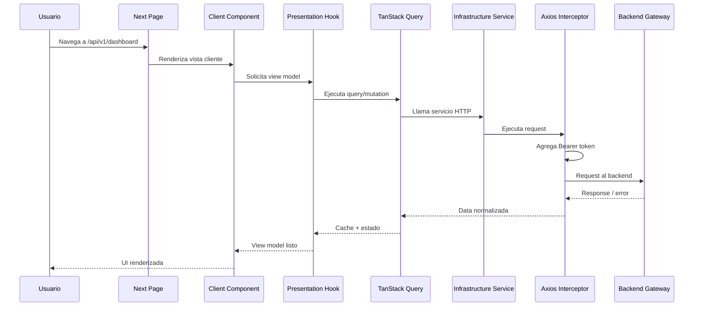

<p align="center">
  
</p>

<h1 align="center">Peer Ledger Frontend</h1>

<p align="center">
  Frontend enterprise para una plataforma P2P de microservicios con autenticación JWT, wallet, historial, transferencias, antifraude y dashboard operativo.
</p>

***

## Table of contents

- [Descripción general](#descripción-general)
- [⚙️ Características principales](#️características-principales)
- [🏛️ Arquitectura del frontend](#️arquitectura-del-frontend)
  - [Capas del proyecto](#capas-del-proyecto)
  - [Flujo de datos](#flujo-de-datos)
- [Estructura del proyecto](#estructura-del-proyecto)
- [🧩 Vistas implementadas](#vistas-implementadas)
  - [Login](#login)
  - [Register](#register)
  - [Dashboard principal](#dashboard-principal)
  - [Mi billetera](#mi-billetera)
  - [Historial](#historial)
  - [Transferencias](#transferencias)
  - [Perfil](#perfil)
  - [Seguridad](#seguridad)
- [🔐 Autenticación y sesión](#autenticación-y-sesión)
- [🌐 Capa HTTP y servicios](#capa-http-y-servicios)
- [Contrato esperado del backend](#contrato-esperado-del-backend)
- [🧠 Estado y cache](#estado-y-cache)
- [🧪 Testing](#testing)
- [🚀 Instalación y ejecución local](#instalación-y-ejecución-local)
- [🛠️ Scripts disponibles](#scripts-disponibles)
- [✅ Calidad y CI](#calidad-y-ci)
- [Contribuciones](#contribuciones)
  - [Convenciones de Commits](#convenciones-de-commits)
- [Licencia](#licencia)
- [📬 Contacto](#contact-anchor)

## Descripción general

**Peer Ledger Frontend** es una aplicación web construida con **Next.js 16**, **React 19**, **TypeScript**, **SCSS Modules**, **TanStack Query**, **Zustand**, **Axios**, **React Hook Form** y **Zod**.

La aplicación funciona como frontend operativo de una plataforma P2P basada en microservicios. Permite registrar usuarios, iniciar sesión, consultar el dashboard financiero, auditar movimientos, enviar dinero, revisar información de perfil y visualizar controles de seguridad/antifraude.

El foco del proyecto es mantener una arquitectura limpia, separando responsabilidades entre dominio, infraestructura, presentación y utilidades compartidas. La UI mantiene un diseño oscuro, limpio y enterprise, pensado para una plataforma financiera P2P.

***

<a id="️características-principales"></a>
## ⚙️ Características principales

- Autenticación con JWT access token y refresh token.
- Persistencia de sesión en cookies y Zustand.
- Interceptor Axios con `Authorization: Bearer <token>`.
- Refresh automático de sesión cuando expira el access token.
- Protección de rutas por middleware.
- Login y register con Zod + React Hook Form.
- Dashboard principal consumiendo `/me/dashboard`.
- Perfil consumiendo `/me/profile`.
- Mi billetera consumiendo `/me/wallet`, `/me/topups` y `POST /topups`.
- Historial operativo consumiendo `/me/activity`.
- Transferencias P2P con `POST /transfers`.
- Recargas de saldo con `POST /topups`.
- Idempotency key para reintentos seguros de transferencias.
- Manejo de `rule_code` antifraude y `Retry-After`.
- Cache de datos con TanStack Query.
- Estado global de auth con Zustand.
- Componentes reutilizables por vista.
- Estilos con SCSS Modules.
- Testing con Jest y Testing Library.
- CI preparado para validar lint, tests y TypeScript.

***

<a id="️arquitectura-del-frontend"></a>
## 🏛️ Arquitectura del frontend

La aplicación sigue una separación por capas:

- `app`: rutas de Next.js App Router.
- `domain`: interfaces, types y modelos de vista.
- `infrastructure`: servicios HTTP, API actions y configuración de transporte.
- `presentation`: componentes visuales, hooks de UI/query y providers.
- `shared`: constantes globales, schemas y utilidades puras.
- `lib`: configuración transversal como Axios y Zustand.
- `__tests__`: pruebas unitarias y de componentes.

### Capas del proyecto

```txt
UI Route (app)
  -> Presentation Component
    -> Presentation Hook
      -> TanStack Query / Zustand
        -> Infrastructure Service
          -> Http Client / Axios Interceptor
            -> Backend API
```

Reglas principales:

- Las páginas en `app` son entrypoints mínimos.
- Los componentes no hacen peticiones directas.
- Las peticiones viven en `infrastructure/services`.
- El cache vive en hooks de `presentation/hooks`.
- Los cálculos de UI viven en `shared/utils`.
- Los contratos viven en `domain/interfaces`.
- Los view models viven en `domain/models`.
- Las constantes globales viven en `shared/constants`.

### Flujo de datos



## Estructura del proyecto

```txt
peer-ledger-frontend/
├── app/                              # Next.js App Router
│   ├── api/v1/login/                 # Vista de inicio de sesión
│   ├── api/v1/register/              # Vista de registro
│   └── api/v1/dashboard/             # Layout y vistas protegidas
│       ├── history/                  # Historial operativo
│       ├── my-wallet/                # Mi billetera y recargas
│       ├── profile/                  # Perfil
│       ├── security/                 # Seguridad
│       └── tranfers/                 # Transferencias P2P
├── domain/
│   ├── interfaces/                   # Contratos API
│   ├── models/                       # View models
│   └── types/                        # Tipos compartidos
├── infrastructure/
│   ├── api/                          # Create actions globales
│   ├── http/                         # Http client
│   └── services/                     # Servicios HTTP
├── lib/
│   ├── axios/                        # Axios instance + interceptors
│   └── store/                        # Zustand stores
├── presentation/
│   ├── components/                   # Componentes reutilizables
│   ├── hooks/                        # Hooks de UI, query y mutations
│   └── providers/                    # Providers cliente
├── shared/
│   ├── constants/                    # Constantes globales
│   └── utils/                        # Helpers, schemas y transformaciones
├── __tests__/                        # Tests
├── middleware.ts                     # Protección de rutas
├── jest.config.ts                    # Configuración de Jest
├── next.config.ts                    # Configuración de Next.js
└── package.json
```

<a id="vistas-implementadas"></a>
## 🧩 Vistas implementadas

<a id="login"></a>
### Login

Ruta:

```txt
/api/v1/login
```

Funcionalidades:

- Formulario validado con Zod + React Hook Form.
- Request a `POST /auth/login`.
- Manejo de errores de credenciales.
- Persistencia de sesión en cookies y Zustand.
- Mensaje de éxito.
- Redirección al dashboard.
- Bloqueo de acceso si el usuario ya está autenticado.

<a id="register"></a>
### Register

Ruta:

```txt
/api/v1/register
```

Funcionalidades:

- Formulario validado con Zod + React Hook Form.
- Request a `POST /auth/register`.
- Política de contraseña:
  - mínimo 8 caracteres
  - al menos una mayúscula
  - al menos una minúscula
  - al menos un número
  - al menos un signo de puntuación o símbolo
- Mensaje de creación exitosa.
- Redirección al login.

<a id="dashboard-principal"></a>
### Dashboard principal

Ruta:

```txt
/api/v1/dashboard
```

Fuente principal:

```txt
GET /me/dashboard
```

Renderiza:

- Saldo disponible.
- Métricas rápidas.
- Últimas transferencias.
- Resumen de topups.
- Alertas operativas.
- Acciones rápidas, incluyendo `Recibir dinero` hacia `/api/v1/dashboard/profile#receive-id`.
- Últimas transferencias con contraparte por `counterparty_name` o `counterparty_id` cuando backend lo informa.

<a id="mi-billetera"></a>
### Mi billetera

Ruta:

```txt
/api/v1/dashboard/my-wallet
```

Fuentes:

```txt
GET /me/wallet
GET /me/topups
POST /topups
```

Query params soportados para recargas:

```txt
page
page_size
from
to
```

Funcionalidades:

- Saldo disponible como dato principal.
- Resumen de recargas:
  - recargas totales
  - monto total recargado
  - recargas de hoy
  - monto recargado hoy
- Formulario operativo de recarga con Zod + React Hook Form.
- Request real a `POST /topups`.
- `user_id` tomado desde la sesión autenticada.
- Historial interno de recargas.
- Filtros por fechas `from` y `to`.
- Paginación de recargas.
- Alertas operativas por recargas `blocked`, `failed` o `partial`.
- Estado positivo cuando no hay alertas.
- Acciones rápidas hacia transferencias, historial y perfil.
- Estados de loading, error total, error parcial, empty y sesión faltante.

Invalidación de cache luego de recargar:

```txt
/me/wallet
/me/dashboard
/me/topups
/me/activity
```

<a id="historial"></a>
### Historial

Ruta:

```txt
/api/v1/dashboard/history
```

Fuente:

```txt
GET /me/activity
```

Query params soportados:

```txt
page
page_size
kind
from
to
```

Funcionalidades:

- Vista de historial operativo.
- Filtros por:
  - Todo
  - Transferencias
  - Recargas
- Filtros por fechas `from` y `to`.
- Summary cards.
- Tabla responsive.
- Paginación.
- Estados de loading, error, empty y sesión faltante.
- Dirección de transferencia:
  - `transfer_received` -> `Recibida`
  - `transfer_sent` -> `Enviada`
  - fallback por `direction`
- Saldo posterior por `balance_after`, calculado desde la perspectiva del usuario autenticado.

<a id="transferencias"></a>
### Transferencias

Ruta:

```txt
/api/v1/dashboard/tranfers
```

> Nota: se mantiene `tranfers` porque es la ruta actual del proyecto.

Fuentes:

```txt
GET /me/wallet
GET /me/activity?kind=transfer
POST /transfers
```

Funcionalidades:

- Consulta de saldo disponible.
- Formulario de envío P2P.
- Receptor por `receiver_id`.
- Validación con Zod + React Hook Form.
- `idempotency_key` generada en frontend.
- Reutilización de `idempotency_key` para reintentos del mismo intento.
- Regeneración de key luego de éxito.
- Manejo de `rule_code` antifraude.
- Manejo de `Retry-After`.
- Invalidación de cache luego de transferir:
  - `/me/wallet`
  - `/me/dashboard`
  - `/me/activity`

Reglas operativas visibles:

- Máximo por transferencia: `20000`.
- Máximo diario enviado: `50000`.
- Velocidad máxima: `5 transferencias / 10 minutos`.
- Cooldown mismo receptor: `30 segundos`.
- Idempotency key: `24 horas`.

<a id="perfil"></a>
### Perfil

Ruta:

```txt
/api/v1/dashboard/profile
```

Fuente:

```txt
GET /me/profile
```

Renderiza:

- Nombre.
- Email.
- ID de usuario.
- Estado de cuenta.
- Señales de seguridad de sesión.
- Acciones hacia seguridad, billetera e historial.

<a id="seguridad"></a>
### Seguridad

Ruta:

```txt
/api/v1/dashboard/security
```

Vista informativa basada en constantes internas y sesión local.

Renderiza:

- Estado del access token.
- Expiración del token.
- Duración teórica de access token: `24h`.
- Duración teórica de refresh token: `168h`.
- Rutas protegidas.
- Política de contraseña.
- Rate limits.
- Reglas antifraude.
- Mensajes por `rule_code`.
- Acciones seguras.

## 🔐 Autenticación y sesión

La autenticación usa access token y refresh token emitidos por el backend.

Endpoints:

```txt
POST /auth/login
POST /auth/register
POST /auth/refresh
```

Tokens:

- Access token: `24h`.
- Refresh token: `168h`.

La sesión se guarda en:

- Cookies cliente.
- Zustand store en `lib/store/auth-store.ts`.

El middleware protege:

- `/api/v1/dashboard`
- `/api/v1/dashboard/:path*`

Reglas:

- Si el usuario no está autenticado, no puede entrar al dashboard.
- Si el usuario está autenticado, no puede entrar a `/`, `/api/v1/login` ni `/api/v1/register`.

## 🌐 Capa HTTP y servicios

La capa HTTP se centraliza en:

```txt
lib/axios/axios-config.ts
infrastructure/http/http-client.ts
infrastructure/services/
```

Servicios principales:

```txt
getMeProfile()
getMeDashboard()
getMeWallet()
getMeTopups(params)
getMeActivity(params)
createTransfer(payload)
createTopUp(payload)
```

Endpoints `/me/*`:

```txt
GET /me/profile
GET /me/dashboard
GET /me/wallet
GET /me/topups
GET /me/activity
```

Transferencias:

```txt
POST /transfers
```

Recargas:

```txt
POST /topups
```

El interceptor Axios:

- Agrega `Authorization: Bearer <token>`.
- Ejecuta refresh automático ante `401`.
- Limpia sesión si el refresh falla.
- Normaliza errores.
- Conserva `rule_code`.
- Conserva `Retry-After` como `retryAfter`.

<a id="contrato-esperado-del-backend"></a>
## Contrato esperado del backend

Para que el frontend pueda mostrar correctamente contraparte, dirección y saldo posterior, las rutas que devuelven actividad financiera deben responder datos desde la perspectiva del usuario autenticado.

Rutas que deben mantenerse alineadas:

```txt
GET /me/dashboard
GET /me/activity
GET /history/{userID}
```

### Contraparte en transferencias

En cada transferencia, el backend debería enviar:

```json
{
  "counterparty_id": "id-del-otro-usuario",
  "counterparty_name": "Nombre del otro usuario"
}
```

Regla esperada:

```txt
transfer_sent:
  counterparty_id = receiver_id
  counterparty_name = receiver.name

transfer_received:
  counterparty_id = sender_id
  counterparty_name = sender.name
```

`counterparty_id` debería venir siempre que exista otro usuario. `counterparty_name` puede ser opcional, pero mejora la experiencia visual en Dashboard e Historial.

Fallback actual del frontend:

```txt
counterparty_name
counterparty_id truncado
Contraparte no disponible
```

Si `/api/v1/dashboard` muestra `Contraparte no disponible`, significa que el backend no envió `counterparty_name` ni `counterparty_id` para ese movimiento.

### Saldo posterior por movimiento

`balance_after` debe representar el saldo posterior del usuario autenticado, no un balance global ni el balance de la otra parte.

Regla esperada:

```txt
transfer_sent:
  balance_after = saldo del sender después de enviar

transfer_received:
  balance_after = saldo del receiver después de recibir

topup:
  balance_after = saldo del usuario después de la recarga
```

Ejemplo para una transferencia recibida:

```json
{
  "id": "transfer-123",
  "kind": "transfer_received",
  "status": "completed",
  "amount": 3000,
  "direction": "received",
  "counterparty_id": "sender-user-id",
  "counterparty_name": "Juan Perez",
  "balance_after": 18000,
  "created_at": "2026-04-20T22:20:00Z"
}
```

Si `/api/v1/dashboard/history` muestra `No disponible` en `Saldo posterior`, significa que el backend no envió `balance_after` para ese movimiento.

## 🧠 Estado y cache

Estado global:

```txt
lib/store/auth-store.ts
```

Cache server-state:

```txt
@tanstack/react-query
```

Provider:

```txt
presentation/providers/app-query-provider.tsx
```

Query keys:

```txt
shared/constants/query.constants.ts
```

Defaults `/me/*`:

- `staleTime: 30_000`
- `retry: 1`
- `refetchOnWindowFocus: true`

## 🧪 Testing

Stack:

- Jest
- Testing Library
- jest-dom
- next/jest

Cobertura actual:

- Utils de dashboard, historial, transferencias, billetera, perfil y seguridad.
- Hooks de TanStack Query.
- Hooks de view model.
- Servicios HTTP.
- Componentes principales.
- Shell de dashboard.
- CI workflow.

Ejecutar tests:

```bash
npm run test -- --runInBand
```

Ejecutar tests en watch mode:

```bash
npm run test:watch
```

Coverage:

```bash
npm run test:coverage
```

## 🚀 Instalación y ejecución local

### Prerrequisitos

- Node.js compatible con Next.js 16.
- npm.
- Backend gateway corriendo en `http://localhost:8080`.

### 1) Clonar el repositorio

```bash
git clone https://github.com/Lucascabral95/peer-ledger-frontend.git
cd peer-ledger-frontend
```

### 2) Instalar dependencias

```bash
npm install
```

### 3) Configurar variables de entorno

Crear `.env`:

```env
NEXT_PUBLIC_API_URL_BACKEND=http://localhost:8080
```

### 4) Ejecutar en desarrollo

```bash
npm run dev
```

Abrir:

```txt
http://localhost:3000
```

## 🛠️ Scripts disponibles

| Script | Descripción |
| :--- | :--- |
| `npm run dev` | Levanta Next.js en modo desarrollo. |
| `npm run build` | Genera build de producción. |
| `npm run start` | Ejecuta el build de producción. |
| `npm run lint` | Ejecuta ESLint. |
| `npm run test` | Ejecuta Jest. |
| `npm run test:watch` | Ejecuta Jest en modo watch. |
| `npm run test:coverage` | Ejecuta Jest con coverage. |

## ✅ Calidad y CI

Validaciones recomendadas antes de merge:

```bash
npx tsc --noEmit
npm run lint
npm run test -- --runInBand
```

El proyecto incluye GitHub Actions en:

```txt
.github/workflows/ci.yml
```

Objetivo del CI:

- Instalar dependencias.
- Validar TypeScript.
- Ejecutar lint.
- Ejecutar tests.
- Bloquear merges si falla la suite.

## Contribuciones

Las contribuciones son bienvenidas. Flujo recomendado:

1. Crear una rama desde la rama principal.
2. Implementar el cambio respetando la arquitectura por capas.
3. Agregar o actualizar tests.
4. Ejecutar TypeScript, lint y tests.
5. Abrir Pull Request con descripción clara.

### Convenciones de Commits

Este proyecto sigue [Conventional Commits](https://www.conventionalcommits.org/):

- `feat:` nueva funcionalidad.
- `fix:` corrección de bugs.
- `docs:` cambios en documentación.
- `style:` cambios de formato que no afectan lógica.
- `refactor:` refactorización.
- `test:` agregar o modificar tests.
- `chore:` tareas de mantenimiento.

---

## Licencia

Este proyecto está bajo la licencia **MIT**.

---

<a id="contact-anchor"></a>
## 📬 Contacto

- **Autor:** Lucas Cabral
- **Email:** lucassimple@hotmail.com
- **LinkedIn:** [https://www.linkedin.com/in/lucas-gastón-cabral/](https://www.linkedin.com/in/lucas-gastón-cabral/)
- **Portfolio:** [https://portfolio-web-dev-git-main-lucascabral95s-projects.vercel.app/](https://portfolio-web-dev-git-main-lucascabral95s-projects.vercel.app/)
- **Github:** [https://github.com/Lucascabral95](https://github.com/Lucascabral95/)

---

<p align="center">
  Desarrollado con ❤️ por Lucas Cabral
</p>
